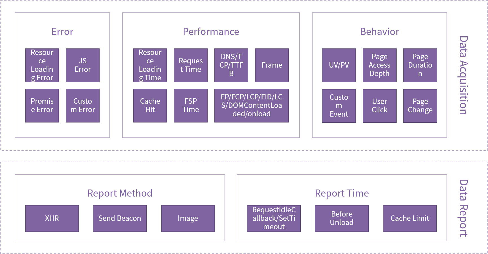
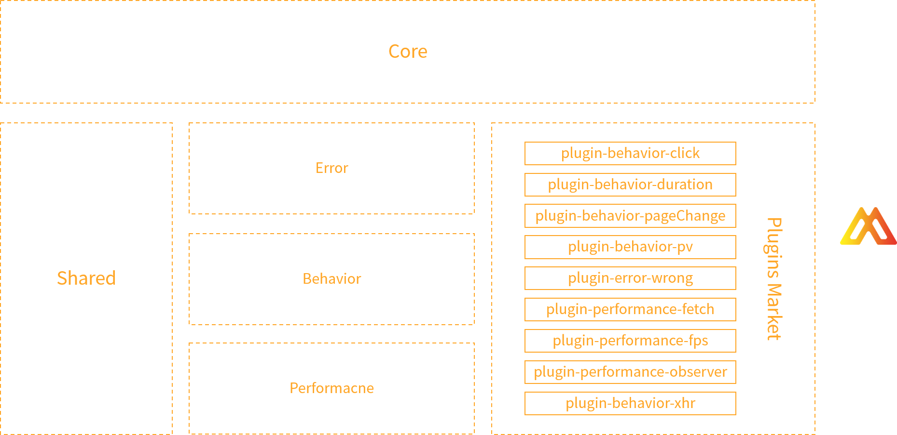

<h2 align="center">Monere</h2>

## Introduction

> Monere is A Web Monitor SDK

## Principle

The whole front-end monitoring SDK adopts the plugin-based architecture design scheme, which can form corresponding functions through various plugin integrations.

For the selection of front-end architecture, an object-oriented programming (OOP) based approach is chosen to integrate functions such as performance, error, and behavior separately.

## Plugins

|Project|Description|
|:-:|:-:|
|[plugin-behavior-pv](https://github.com/vee-monere/monere/tree/main/packages/plugin-behavior-pv)|Behavior Monitor--PV|
|[plugin-behavior-click](https://github.com/vee-monere/monere/tree/main/packages/plugin-behavior-click)|Behavior Monitor--User Click|
|[plugin-behavior-duration](https://github.com/vee-monere/monere/tree/main/packages/plugin-behavior-duration)|Behavior Monitor--Page Duration|
|[plugin-behavior-pagechange](https://github.com/vee-monere/monere/tree/main/packages/plugin-behavior-pagechange)|Behavior Monitor--Page Change|
|[plugin-error-wrong](https://github.com/vee-monere/monere/tree/main/packages/plugin-error-wrong)|Error Monitor--JS Error|
|[plugin-performance-fetch](https://github.com/vee-monere/monere/tree/main/packages/plugin-performacne-fetch)|Performance Monitor--Fetch Request|
|[plugin-performance-fps](https://github.com/vee-monere/monere/tree/main/packages/plugin-performacne-fps)|Performance Monitor--Frame Per Seconds|
|[plugin-performance-xhr](https://github.com/vee-monere/monere/tree/main/packages/plugin-performacne-xhr)|Performance Monitor--XML Http Request|
|[plugin-performance-observer](https://github.com/vee-monere/monere/tree/main/packages/plugin-performacne-observer)|Performance Monitor--CLS/Entries/FID/FSP/LCP/Paint/Load|

## License

[MIT](http://opensource.org/licenses/MIT)

Copyright (c) 2021-present VLeeDesignTheory

